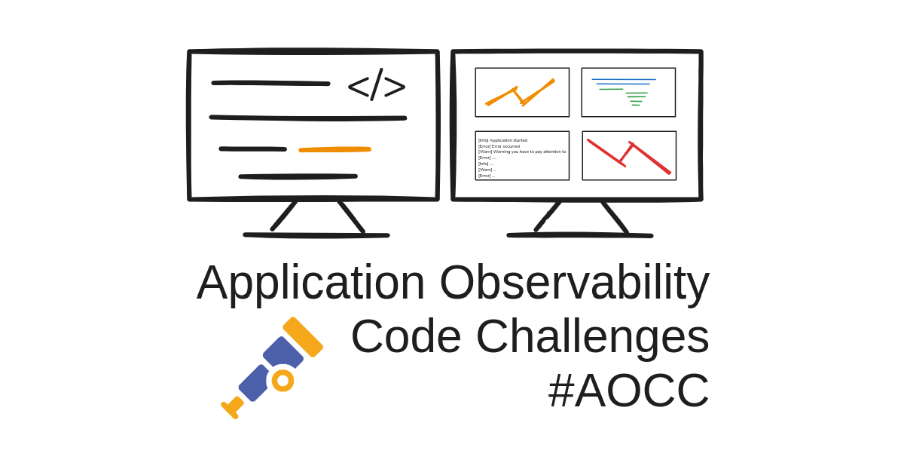
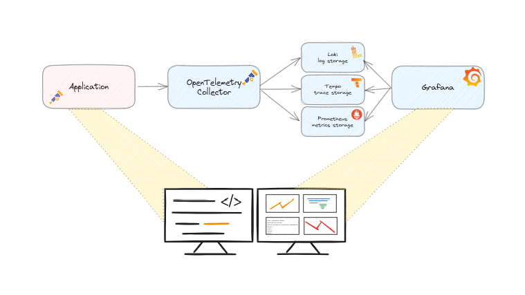
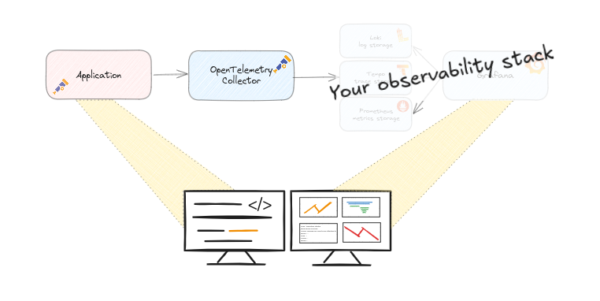

# Application Observability Code Challenges

Application Observability Code Challenges are a way to challenge yourself to improve the observability of a sample application. Of course, this application has some surprises that you probably did not expect.
These puzzlers will help you develop an observability mindset and become more familiar with your observability tools.

See the announcement blog about [Application Observability Code Challenges](https://goto.ceesbos.nl/aocc) for more information.

## Goals
The goals of the challenges:
- 🎉 - Have fun !
- 🖵 - Learn to understand the behaviour of the code
- 📈 - Learn how to use observability tools to understand code behaviour 📈
- 🔍 - Spot the unexpected behaviour!
- 🤗 - Practice and learn!
- 🎁 - Share your findings and solution, either as a comment or as a pull request

The goal is not to discuss the libraries, frameworks or specific code implementation used, but to practice and learn!

## What do the code challenges look like?

The first challenge is currently in preparation, but the plan is that you can easily run it locally.   
My background is in Java development, so most of the challenges I will provide will be Java challenges. I have a number of them in mind.

The challenge will be available in a git repository, all prepared to run on your system as smooth as possible.
The application will already produce some telemetry data with OpenTelemetry.  
The **challenge** is to find the problem and **extend the observability** to get better insights and also **proof** that a potential **solution works** as expected.

Using the [Observability Toolkit](https://github.com/cbos/observability-toolkit) you can easily spin up OpenTelemetry and Grafana based observability tools.   
You can then run a sample application and a test script.   
In Grafana you can see the first results, then it is up to you to continue. Some hints will be provided.

The whole setup will look like this:    

## Online environment(s)

Besides running it locally, you can use an online Killercoda environment, [https://killercoda.com/observability-code-challenges](https://goto.ceesbos.nl/aocckk).   
By default you can use an online environment for 60 minutes, then it stops automatically.
With killercoda you don't have to mess with your local machine and it will give you some more guidance.

If you are like to use devcontainers, please create an incident or a pull request 😀.

## Your own stack

If you usually use other observability tools, I encourage you to use them!   
The sample application is prepared to send data using OpenTelemetry, so any setup that supports OTLP will work.

# Challenges

- [Challenge 1](challenge-01/README.md) - Spring boot with Jersey/JAX-RS REST endpoint with some strange behaviour 🤔
- [Challenge 2](challenge-02/README.md) - Spot the difference between system thread and virtual thread usage for the same application with some problems