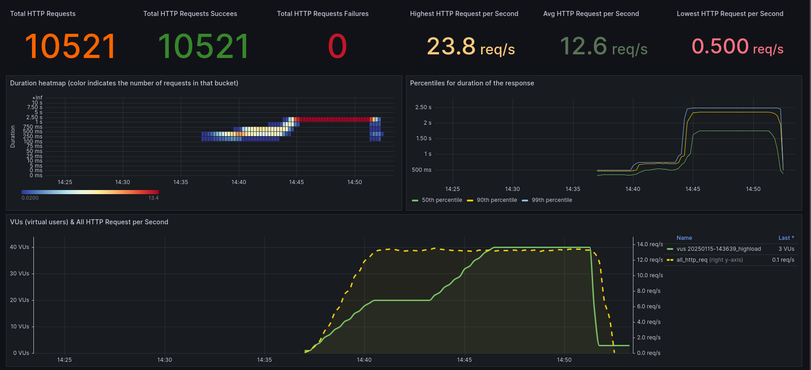

# Application Observability Code Challenge 1 


This is the first challenge of the Application Observability Code Challenges.   
See the [announcement blog](https://goto.ceesbos.nl/aocc) or the [repository README](../README.md) for more information about the challenges.
And [first challenge blogpost](https://goto.ceesbos.nl/c1) for the announcement of this first challenge.
The goal is to have fun and learn in the first place.

> 🚨 **Challenge**:
> - Run the sample application
> - Run the tests to see what happens
> - Try to find out what happens, make a hypothesis❗
> - **Improve the observability** of the application to **prove the hypothesis**
> - Optional: fix the problem and **prove it with observability data that it is really fixed**
> - Optional, but highly appreciated 🙏: Share your findings, insights you learned and potential solution, either as a ['discussion'](https://github.com/cbos/application-observability-code-challenges/discussions) or as a pull request

An online guided environment is available with KillerCode, see [https://killercoda.com/observability-code-challenges](https://goto.ceesbos.nl/aocckk)

## Challenge

## Setup in this repository

- The sample application is a simple Spring Boot application with a REST endpoint implemented in Jersey/JAX-RS.
- The application is instrumented using OpenTelemetry auto instrumentation.
- You can either run the application with Docker or directly.

## Pre-requisites

- Java 21 (if you want to use a lower version, you will need to modify the pom.xml)
- Docker (if you want to use the provided docker-compose file)
- Just CLI (optional, but recommended)

## Prepare the environment

### Clone the repository
To be able to run the sample application, you need to clone this repository.   
Clone the repository to your local machine and go to the folder of `challenge-01`.

```shell
git clone https://github.com/cbos/application-observability-code-challenges
cd application-observability-code-challenges/challenge-01
```

### Download the OpenTelemetry Java agent jar

```shell
just download-otel
```
This downloads the OpenTelemetry Java agent jar to the `.otel` directory.

### Build the application

```shell
just build 
# or if you want to do it manually
./mvnw clean verify
```
This will build and package the application.

### Observability Toolkit or your own stack
Launch your observability stack or use the Observability Toolkit.
The sample application assumes that you have an OpenTelemetry endpoint running at `localhost:4318`.

If you don't have any observability tools running, you can run a preconfigured setup with the following commands:

```shell
git clone https://github.com/cbos/observability-toolkit
cd observability-toolkit
just up # or docker-compose up -d 
```
Now you can open http://localhost:3000 to open Grafana.

## Run the application

To run the example application, you can use the following command:

```shell

just run-app
# or if you want to do it manually
OTEL_JAVAAGENT_CONFIGURATION_FILE="./opentelemetry.properties" java -javaagent:.otel/opentelemetry-javaagent.jar -jar target/challenge-01-0.0.1-SNAPSHOT.jar

# or if you want to run it with Docker
just up
just down # to stop the docker container
just ps # to see the status of the container
just logs application # to see the logs of the application
````
This will start the application on port 8080.
You can test it by opening [http://localhost:8080/spring-app/challenge/](http://localhost:8080/spring-app/challenge/) in your browser.
The application is using auto-instrumentation of OpenTelemetry, which provides a foundation for observability, but is it enough for this challenge?

# Test runs with k6

To get more information about the problems, a set of test scripts is available.
These testscripts are implemented with [K6](https://grafana.com/oss/k6/), a load testing tool that can also be used for performance testing.
K6 also produces metrics as well in OpenTelemetry format.

The setup looks like this:


## Run simple load test

```shell
just k6-simple-load
```

```shell
K6_OTEL_GRPC_EXPORTER_INSECURE=true K6_OTEL_METRIC_PREFIX=k6_ k6 run --tag test-id="20250115-141121_simpleload" -o experimental-opentelemetry k6/simpleload.js

         /\      Grafana   /‾‾/  
    /\  /  \     |\  __   /  /   
   /  \/    \    | |/ /  /   ‾‾\ 
  /          \   |   (  |  (‾)  |
 / __________ \  |_|\_\  \_____/ 

     execution: local
        script: k6/simpleload.js
        output: opentelemetry (grpc (insecure), localhost:4317)

     scenarios: (100.00%) 1 scenario, 2 max VUs, 5m30s max duration (incl. graceful stop):
              * default: 2 looping VUs for 5m0s (gracefulStop: 30s)


running (0m24.9s), 2/2 VUs, 35 complete and 0 interrupted iterations
default   [==>-----------------------------------] 2 VUs  0m24.9s/5m0s
```
You can see that the scenario runs for 5 minutes with 2 VUs (Virtual Users).   
Depending on your setup, you can view the result in your Observability Stack.   
If you have the Observability Toolkit running, you can view the results in Grafana.   
See [http://localhost:3000/d/o11ytk-k6-load-test/k6-load-test](http://localhost:3000/d/o11ytk-k6-load-test/k6-load-test) for the K6 dashboard.

Once the test is complete, you can view the results in the console, like this

```shell
data_received..................: 63 kB 208 B/s
     data_sent......................: 47 kB 155 B/s
     http_req_blocked...............: avg=23.98µs  min=6.26µs   med=11.75µs  max=923.41µs p(90)=20.72µs  p(95)=28.09µs 
     http_req_connecting............: avg=6.57µs   min=0s       med=0s       max=667.85µs p(90)=0s       p(95)=0s      
     http_req_duration..............: avg=314.89ms min=205.77ms med=311.47ms max=1.51s    p(90)=390.29ms p(95)=398.55ms
       { expected_response:true }...: avg=314.89ms min=205.77ms med=311.47ms max=1.51s    p(90)=390.29ms p(95)=398.55ms
     http_req_failed................: 0.00% 0 out of 457
     http_req_receiving.............: avg=139.18µs min=63.39µs  med=128.29µs max=379.08µs p(90)=194.45µs p(95)=226.97µs
     http_req_sending...............: avg=43.44µs  min=17.46µs  med=38.61µs  max=218.3µs  p(90)=62.6µs   p(95)=73.6µs  
     http_req_tls_handshaking.......: avg=0s       min=0s       med=0s       max=0s       p(90)=0s       p(95)=0s      
     http_req_waiting...............: avg=314.71ms min=205.6ms  med=311.33ms max=1.51s    p(90)=390.09ms p(95)=398.41ms
     http_reqs......................: 457   1.517038/s
     iteration_duration.............: avg=1.31s    min=1.2s     med=1.31s    max=2.52s    p(90)=1.39s    p(95)=1.39s   
     iterations.....................: 457   1.517038/s
     vus............................: 1     min=1        max=2
     vus_max........................: 2     min=2        max=2


running (5m01.2s), 0/2 VUs, 457 complete and 0 interrupted iterations
default ✓ [======================================] 2 VUs  5m0s
```

The most interesting line in this case is with the `http_req_duration` which shows the average duration of the requests, but also the outliers.   

### K6 Load test - Grafana Dashboard

See [http://localhost:3000/d/o11ytk-k6-load-test/k6-load-test](http://localhost:3000/d/o11ytk-k6-load-test/k6-load-test) for the K6 dashboard.
At the top of the screen you will see the Test ID with a timestamp of the test start.   
You can either select one or more from the drop down list, or click All to see all test results.    


This is an overview of the most important graphs on the dashboard.   


In the duration heatmap you can see the distribution of the request durations.
In this example, you can see that the majority of requests are in the 250-500ms bucket, which is in line with the console output.      


### Service details - Grafana Dashboard

See [http://localhost:3000/d/o11ytk-service-details/service-details](http://localhost:3000/d/o11ytk-service-details/service-details) for the Service details dashboard.   
The dashboard has details about incoming requests with the RED metrics. Rate, errors and duration.   
It also shows a heat map of request duration for incoming requests.

There are more details per endpoint of the service, but that is not relevant for this test.   
And there are details for the outgoing requests, but that is not relevant for this test either.   

There is also a section with JVM metrics such as memory usage (heap and non-heap), garbage collection and threads.
This gives you more information about the behaviour of the service.   
And there is information about Tomcat, the number of threads specific to Tomcat request handling.

## Run a more complex load test with higher load

To run a more complex load test, you can run the following command:
```shell
just k6-high-load
```

```shell
     scenarios: (100.00%) 1 scenario, 40 max VUs, 15m30s max duration (incl. graceful stop):
              * chain: Up to 40 looping VUs for 15m0s over 6 stages (gracefulRampDown: 0s, gracefulStop: 30s)
```

This test runs for 15 minutes with a ramp up to a maximum of 40 VUs.
But it starts at 2 VUs, ramps up to 20 VUs after a while, and ramps up to 40 VUs after a few minutes.

> 🚨 Check the results to see what happens and try to find out why.   
> Make a hypothesis and try to test it with the observational data.   
> Think about how you can improve the observability to get more insight into the behaviour of the system.

Dashboard of a high load run:  


## Run with heavy query

To run a special test, you can use the following command:
```shell
just k6-with-heavy-query
```

This is not a complicated test, but a test to see what happens when a 'heavy' query is executed.
Suddenly all queries will hang, it is like your customers complaining about a slow system 🚨.


# Observability improvements hints

If an application is auto-instrumented with OpenTelemetry, you can use the following to improve the observability:
- Add more context to the spans, https://opentelemetry.io/docs/zero-code/java/agent/annotations/
- Add more metrics, https://opentelemetry.io/docs/zero-code/java/agent/api/ to add a Meter, based on that you can add counters and gauges for example

# Step by step walk through

> [!CAUTION]
> **Spoiler alert**   
> To take you in a step by step approach I created a blog article. If you want to you can check this page and follow these steps: 
> https://goto.ceesbos.nl/c1s