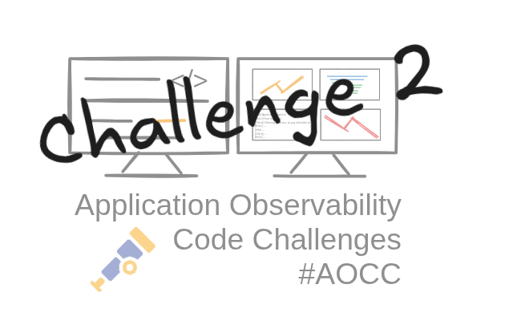
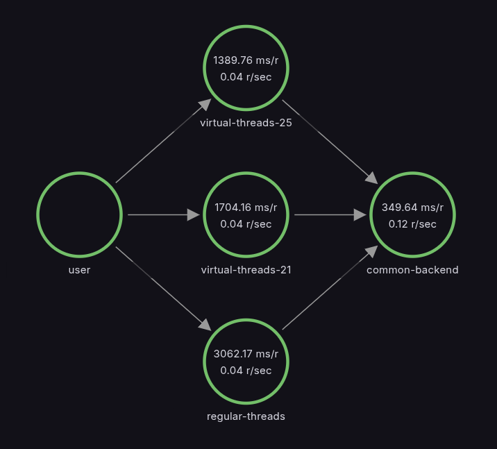

# Application Observability Code Challenge 2


This is the second puzzler of the Application Observability Code Challenges.   
See the [announcement blog](https://goto.ceesbos.nl/aocc) or the [repository README](../README.md) for more information about the challenges in general.
Check out the first challenge as well, if you did not complete it yet.

> 🚨 **Challenge**:
> - Run the sample applications
> - Run the tests to see what happens
> - Try to find out what happens, make a hypothesis❗
> - **Improve the observability** of the applications to **prove the hypothesis**
> - Optional: fix the problem and **prove it with observability data that it is really fixed**
> - Optional, but highly appreciated 🙏: Share your findings, insights you learned and potential solution, either as a ['discussion'](https://github.com/cbos/application-observability-code-challenges/discussions) or as a pull request

An online guided environment is available with KillerCode, see [https://killercoda.com/observability-code-challenges](https://goto.ceesbos.nl/aocckk)

## Challenge

## Summary
This challenge will learn you more about the observability of regular threads and virtual threads and how to make it more observable.

## Setup in this repository

- The setup is a set of applications with actual the same code base, but running with different configuration and Java versions
- The applications are instrumented using OpenTelemetry auto instrumentation.
- You can run the applications with Docker or directly.

## Pre-requisites

- Java 21 (if you want to use a lower version, you will need to modify the pom.xml)
- Docker/Podman
- Just CLI (optional, but recommended)
- [K6](https://grafana.com/docs/k6/latest/set-up/install-k6/) for load testing

## Prepare the environment

### Clone the repository 
Clone the repository to your local machine and go to the folder of `challenge-02`.

```shell
git clone https://github.com/cbos/application-observability-code-challenges
cd application-observability-code-challenges/challenge-02
```

### Download the OpenTelemetry Java agent jar

```shell
just download-otel
```
This downloads the OpenTelemetry Java agent jar to the `.otel` directory.

### Build the application

```shell
just build 
# or if you want to do it manually
./mvnw clean verify
```

### Observability Toolkit or your own stack
Launch your observability stack or use the Observability Toolkit.
The sample application assumes that you have an OpenTelemetry endpoint running at `localhost:4318`.

If you don't have any observability tools running, you can run a preconfigured setup with the following commands:

```shell
git clone https://github.com/cbos/observability-toolkit
cd observability-toolkit
just up # or docker-compose up -d 
```
Now you can open http://localhost:3000 to open Grafana.

## Run the application setup

The setup of application contains 4 applications:
- `common-backend`: A common backend used by three other applications
- `regular-threads`: A version of the application with Java 21 and using regular threads to execute the requests
- `virtual-threads-21`: A version of the application with Java 21 and using `Virtual Threads` to execute the requests
- `virtual-threads-25`: A version of the application with Java 25 and using `Virtual Threads` to execute the requests


To run the setup, you can use the following command:

```shell
# or if you want to run it with Docker
just up  
just down # to stop the docker container
just ps # to see the status of the container
just logs <application_name> # to see the logs of the specific applications

# Without Just you can use:
# docker-compose -f docker/docker-compose.yml up -d --build
# docker-compose -f docker/docker-compose.yml down 
# docker-compose -f docker/docker-compose.yml ps
# docker-compose -f docker/docker-compose.yml logs <application_name>
```
The applications are using auto-instrumentation of OpenTelemetry, which provides a foundation for observability, but is it enough for this challenge?

# Test runs with k6

To get more information about the problems, a set of test scripts is available.
These testscripts are implemented with [K6](https://grafana.com/oss/k6/), a load testing tool that can also be used for performance testing.
K6 also produces metrics as well in OpenTelemetry format.

## Run load scripts

The [first challenge](../challenge-01/README.md) contains a detailed description on how to run the tests and how the output can be viewed and interpreted.    
Please read that first, if you are not familiar with K6.

To run the load tests, you can use the following command:  
```shell
# Just a putting load on the '/' endpoint of the 3 services
just k6-scenario-1
# Or run k6 with the following command, but this does not have metrics pushed:
# k6 run k6/scenario1.js 

# Put load on the /random/<id> endpoint of the 3 services
just k6-scenario-2
````
These tests give load and will give you more insights in the Grafana dashboards.

### K6 Load test - Grafana Dashboard

See [http://localhost:3000/d/o11ytk-k6-load-test/k6-load-test](http://localhost:3000/d/o11ytk-k6-load-test/k6-load-test) for the K6 dashboard.
The first challenge also explains how to use this dashboard.

### Service details - Grafana Dashboard

See [http://localhost:3000/d/o11ytk-service-details/service-details](http://localhost:3000/d/o11ytk-service-details/service-details) for the Service details dashboard.   
The dashboard has details about incoming requests with the RED metrics. Rate, errors and duration.   
It also shows a heat map of request duration for incoming requests.

There are more details per endpoint of the service, but that is not relevant for this test.   
And there are details for the outgoing requests, but that is not relevant for this test either.

There is also a section with JVM metrics such as memory usage (heap and non-heap), garbage collection and threads.
This gives you more information about the behaviour of the service.   
And there is information about Tomcat, the number of threads specific to Tomcat request handling.

And as you might have noticed already, this challenge is about regular threads and virtual threads, these sections are relevant for this challenge.

## Run the final scenario

The last scenario is the actual scenario you need to run, this again puts load on the 3 applications and with that you will see response times of these services will go up, while the response times of the common backend will be fine and stable.   

```shell
just k6-scenario-3
```

In the setup you can see that the 3 applications are using the common-backend.
That is what you can see from the node graph as well in Grafana:

Open Grafana > Explore > Select 'Tempo' as datasource > Select 'Service Graph' tab:




Goals for this challenge:
1) Check if you can find the Java version in the observability data (logs, metrics, traces)
1) Can you spot the latency gap between the services in traces?
1) Can you find the problem based on metrics?
1) And the most important: Can you see the difference between the 3 application `regular-threads` and `virtual-threads-21` and `virtual-threads-25`?
2) What can be done to make it more observable?

